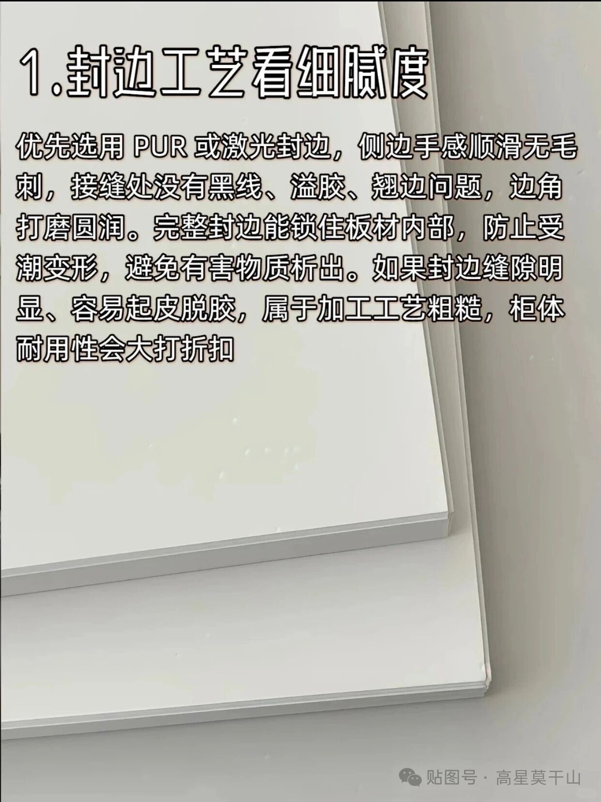
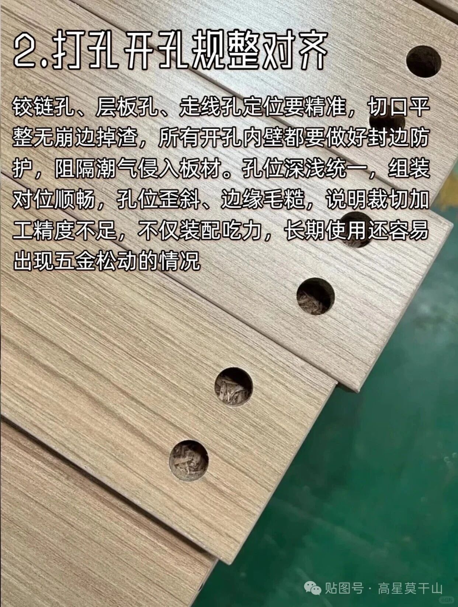
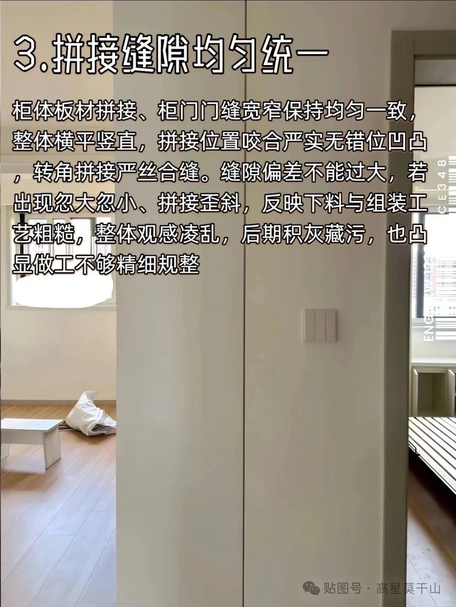
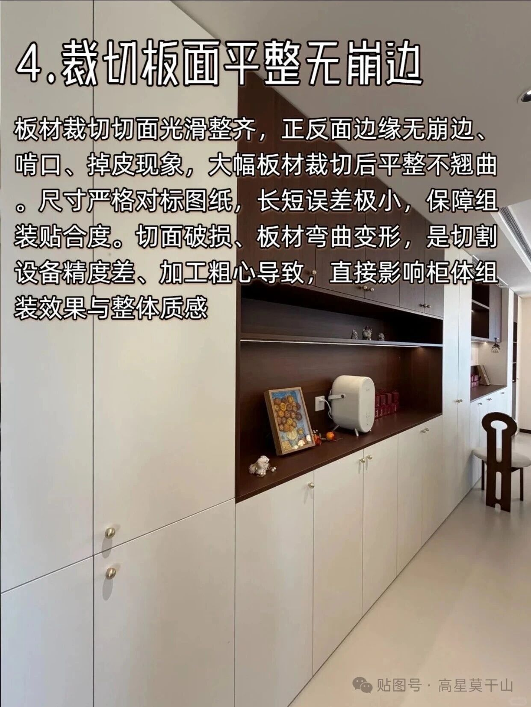
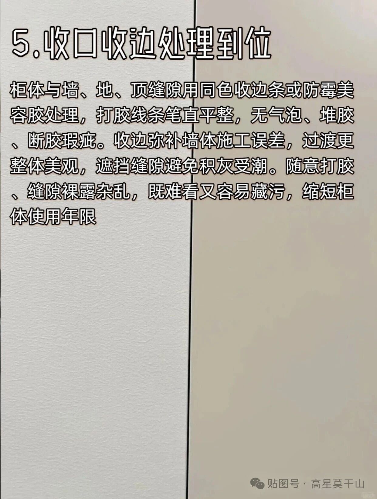
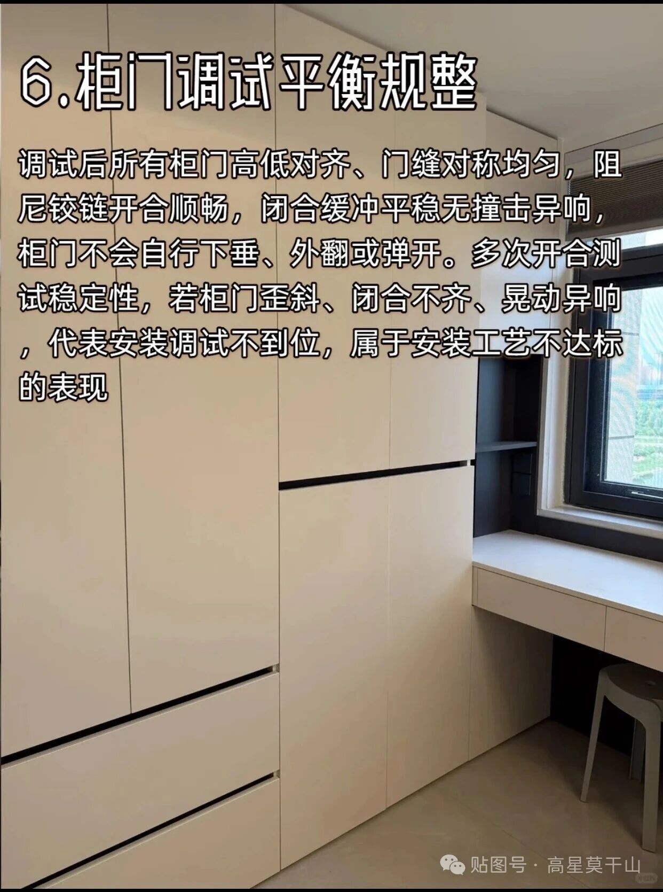

# 柜体工艺六看验收

> 整理说明：本文根据 `xfx-house` 目录下 6 张柜体工艺图转写。图文来源水印为「贴图号 · 高星莫干山」。下文按原图顺序保留原文要点，便于到货和安装对照。落地时仍以合同写死的工艺、品牌和图纸为准。
>
> 原图保存在 `wiki/raw/assets/`。

---

## 1. 封边工艺看细腻度

优先选用 PUR 或激光封边，侧边手感顺滑无毛刺，接缝处没有黑线、溢胶、翘边问题，边角打磨圆润。

完整封边能锁住板材内部，防止受潮变形，避免有害物质析出。

如果封边缝隙明显、容易起皮脱胶，属于加工工艺粗糙，柜体耐用性会大打折扣。

## 2. 打孔开孔规整对齐

铰链孔、层板孔、走线孔定位要精准，切口平整无崩边掉渣，所有开孔内壁都要做好封边防护，阻隔潮气侵入板材。孔位深浅统一，组装对位顺畅，孔位歪斜、边缘毛糙，说明裁切加工精度不足，不仅装配吃力，长期使用还容易出现五金松动的情况。

## 3. 拼接缝隙均匀统一

柜体板材拼接、柜门门缝宽窄保持均匀一致，整体横平竖直，拼接位置咬合严实无错位凹凸，转角拼接严丝合缝。缝隙偏差不能过大，若出现忽大忽小、拼接歪斜，反映下料与组装工艺粗糙，整体观感凌乱，后期积灰藏污，也凸显做工不够精细规整。

## 4. 裁切板面平整无崩边

板材裁切切面光滑整齐，正反面边缘无崩边、啃口、掉皮现象，大幅板材裁切后平整不翘曲。

尺寸严格对标图纸，长短误差极小，保障组装贴合度。

切面破损、板材弯曲变形，是切割设备精度差、加工粗心导致，直接影响柜体组装效果与整体质感。

## 5. 收口收边处理到位

柜体与墙、地、顶缝隙用同色收边条或防霉美容胶处理，打胶线条笔直平整，无气泡、堆胶、断胶瑕疵。

收边弥补墙体施工误差，过渡更整体美观，遮挡缝隙避免积灰受潮。

随意打胶、缝隙裸露杂乱，既难看又容易藏污，缩短柜体使用年限。

## 6. 柜门调试平衡规整

调试后所有柜门高低对齐、门缝对称均匀，阻尼铰链开合顺畅，闭合缓冲平稳无撞击异响，柜门不会自行下垂、外翻或弹开。多次开合测试稳定性，若柜门歪斜、闭合不齐、晃动异响，代表安装调试不到位，属于安装工艺不达标的表现。

